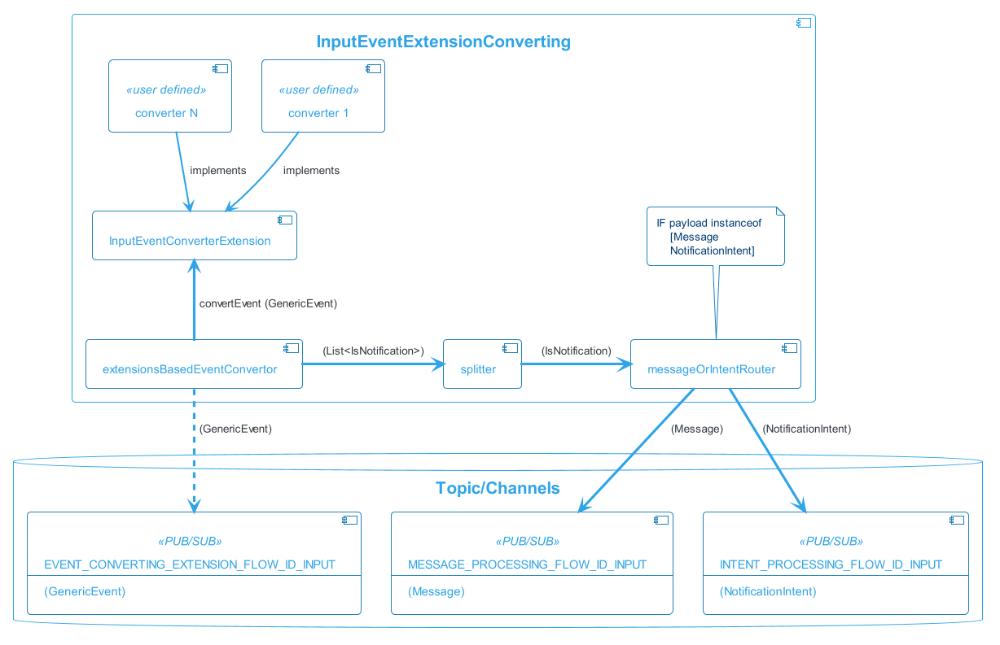
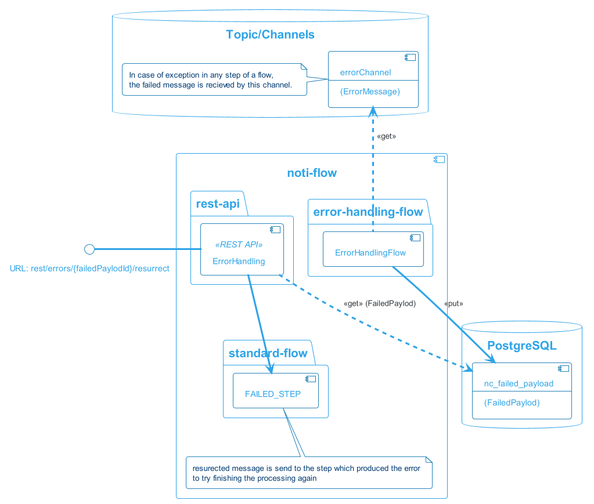

# Flows
Flow is composition of functions (build-in or provided via customisation) that performs some complex logic. Flows can be further composed into final processing flow.

The data between functions in a flow (or between flows) are exchanges via spring integration channels which can me in-memory or configured to some message broker like [RabitMQ](https://www.rabbitmq.com/) or [Kafka](https://kafka.apache.org/)

## Top-level flows (standard-flow)
The default configuration of notiflow cosists of 4 procesing stages

1. [EventReceiver](): Recieve and persist input application [Event]()
1. [InputEventExtensionConverting](): Event to [Intent]()/[Message]() conversion
1. [MessageProcessingFlow](): [Message]() persistance, formatting, ..
1. [Sending](): Sending different types of messages via dedicated channel


This is high level and simplified view on defualt notiflow message processing. Next section describe individual flows in detail

### Notification processing variants
The input to standard-flow (and thus start of input processing) can be done by calling one tree dedicated API enpoints

  * [Input event]() 
    * call to [persistGenericEvent]() API method
    * or call REST API [Post to /events]() endpoint
  * [Notification intent]() 
    * call [processIntent]() API method
  * Specific [Message]() 
    * call [processMessage]() API method
    * or call REST API [Post to /messages]() endpoint

Which one of these three types is selected by the client depends on the particular use-case. 

  * [Input event](): This is used when you want to use notiflow as reciever of any specifi application event your application can produce. This can be events like 
    * "New order" in web shop
    * "Low inventory" in wharehouse 
    * User reuquest for 2-factor authentication
    * ... and any other you might need  

   The intension using this aproach is to ofload as much of the notification processing from the client application as possible. The application focuses on its core business and emits event about what happed. The payload stored in [Input event] can be completely custom and uknown to notiflow

  * [Notification intent](): TODO
  * [Message](): Client application already knows everything about the notification it wants to send, especially 
    * who is the recipient
    * what is the message type ([Email]()/[SMS]()/[Push]()/...)
    * what is the message content
   
    but still wants to use features like [message delivery guaranties](), [journaling](), [spam preventions](), [statistics]() and others   

## Input event routing flow <span id="inputEventRoutingFlow"/>


[Input event routing flow](#inputEventRouting) is responsible for

* Recieve an [event](entities.md#inputEvent) and retun controll to the caller as soon as possible
    * Recieve an [event](entities.md#inputEvent)
    * persist the event 
    * return controll to the caller as soon as event persisted in notflow DB
* [Poll for events]() which should start processing and route them based on the notiflow [configuration]() for input event routing for further processing

This step is only active if client what to use [event]() as a starting point for notification processing

## Input event extension converting flow <span id="inputEventExtensionConvertingFlow"/>


This [flow]() is a place of common customisation. It main purpose is 

  * transleate [event]() to either
    * [message]()

      or

    * [notificationIntent]()

Becuase the payload in event is not know to notiflow, client has to provide custom implementation of such conversion. This is done by implementing [InputEvent2MessageConverterExtension]() interface. For example

```java
        @Bean
        public InputEvent2MessageConverterExtension event2Message() {
            return new InputEvent2MessageConverterExtension () {

				@Override
				public Optional<PayloadValidationException> canHandle(GenericEvent payload) {
					if (payload.getPayloadAsPojo() instanceof TestPayload) {
						return Optional.empty();
					}
					
					return Optional.of(new PayloadValidationException("No test payload"));					
				}

				@Override
				public List<com.obj.nc.domain.message.Message<?>> convertEvent(GenericEvent event) {					
					EmailMessage email1 = new EmailMessage();
					email1.addRecievingEndpoints(
						EmailEndpoint.builder().email("test@objectify.sk").build()
					);
					email1.getBody().setSubject("Subject");
					email1.getBody().setText("text");

					List<com.obj.nc.domain.message.Message<?>> msg = Arrays.asList(email1);

					return msg;
				}            	
            };
        }
```

> InputEvent2MessageConverterExtension implementation has to be registered as Spring @Bean

## Intent processing flow <span id="intentProcessingFlow"/>
TODO

## Message processing flow <span id="messageProcessingFlow"/>

The responsiblity of this flow is to 

 * perform journaling for all [messages]() which are about to be send. This includes persistance of [message]() and information about [recipient]() of the message. 
 * route the [message]() to type dependent sender 

 This flow has API that allows to interact with it. Example:

```java
 @Autowired private MessageProcessingFlow msgFlow;

 void exampleSendMessage()  {
        EmailMessage msg = ...

        // when
        msgFlow.processMessage(msg);
 }
```

## Email processing Flow <span id="emailProcessingFlow"/>

The responsiblity of this flow is to 

 * if the [email is templated](), formate it to final [email message]()
   * if [email is localised](), send email-per-locale or aggregated into one email
 * decorated html [emails]() to track mail opened by recipient
 * send [email]()

This flow has API that allows to interact with it. Example:

```java
 @Autowired private EmailProcessingFlow emailSendingFlow;

 void exampleSendFormatedEmail()  {
        EmailMessageTemplated<?> email = ...
        emailSendingFlow.formatAndSend(email);
        ...
 }
```
or 
```java
@Autowired private EmailProcessingFlow emailSendingFlow;

void exampleSendEmail() {
    EmailMessage email = ...
        
    EmailMessage emailSent = emailSendingFlow
            .sendEmail(email)
        	.get(1, TimeUnit.SECONDS);
}
```

## SMS processing Flow <span id="smsProcessingFlow"/>

The responsiblity of this flow is to

 * format [SMS message]() content (only templated SMS are supported as of now)
 * send [SMS message]()

## MailChimp processing Flow <span id="mailchimpProcessingFlow"/>

The responsiblity of this flow is to
 
 * send Email message using [MailChimp transactional API](https://mailchimp.com/developer/transactional/). Formating of the email is in responsibility of MailChimp

## Error handling flow


In the case of exception in any [function]() participating in a [flow](), the message that caused the error is recieved by this channel with the information about which step was the last that failed. This flow is reposible for

  * resurection af the failed message and execution of retry 

For this to work in any situation, [transaction boundries]() for steps in flows have to be carefully defined

## Delivery Info flows <span id="deliveryInfoFlow"/>

These flows are responsible for persistance of varios journaling information. They listen on predefined topics and document delivery information for given [event](), [intent]() and [message]()

The infomration is later used in [notiflow UI]() for cstatistics and analytics

## Test mode flow <span id="testMode"/>
This is an internal flow which is used in [test mode](). Its responsibility is to 

 * Wait for certain time for messages which should have been send if [test mode]() was not active
 * Aggregate them into single digest Email message
 * Send aggreagted email to predefined recipient
