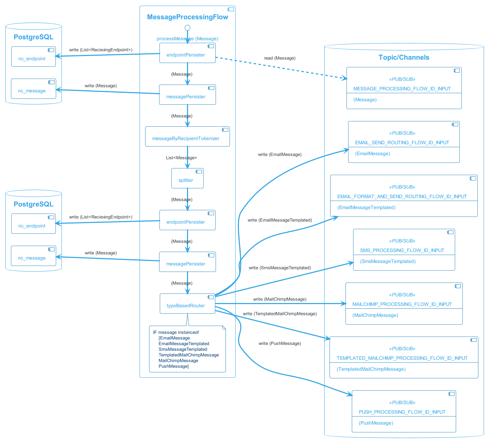
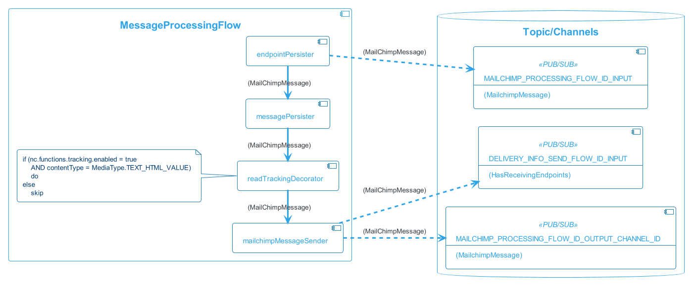
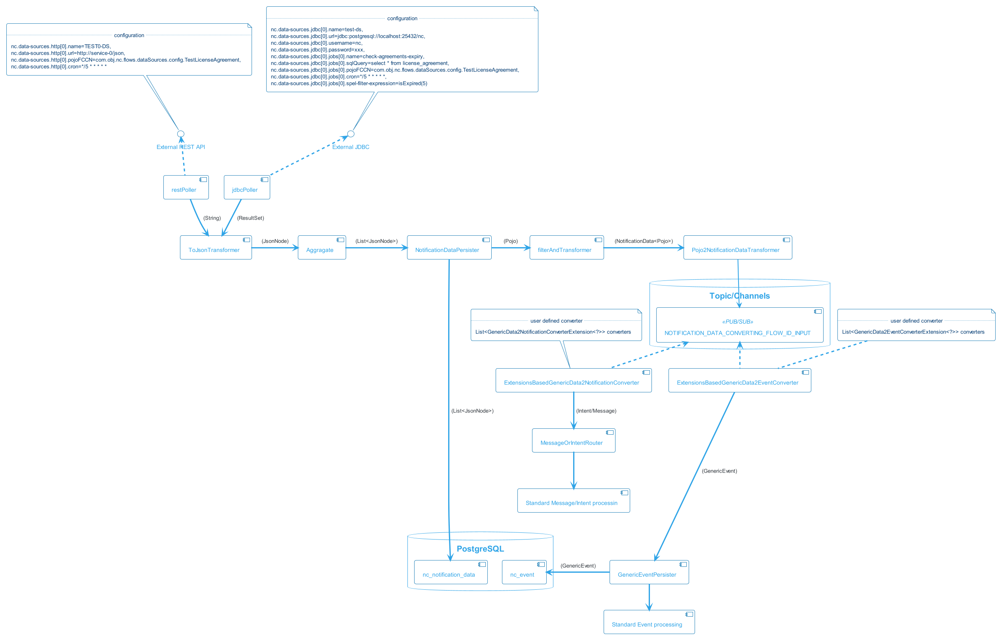
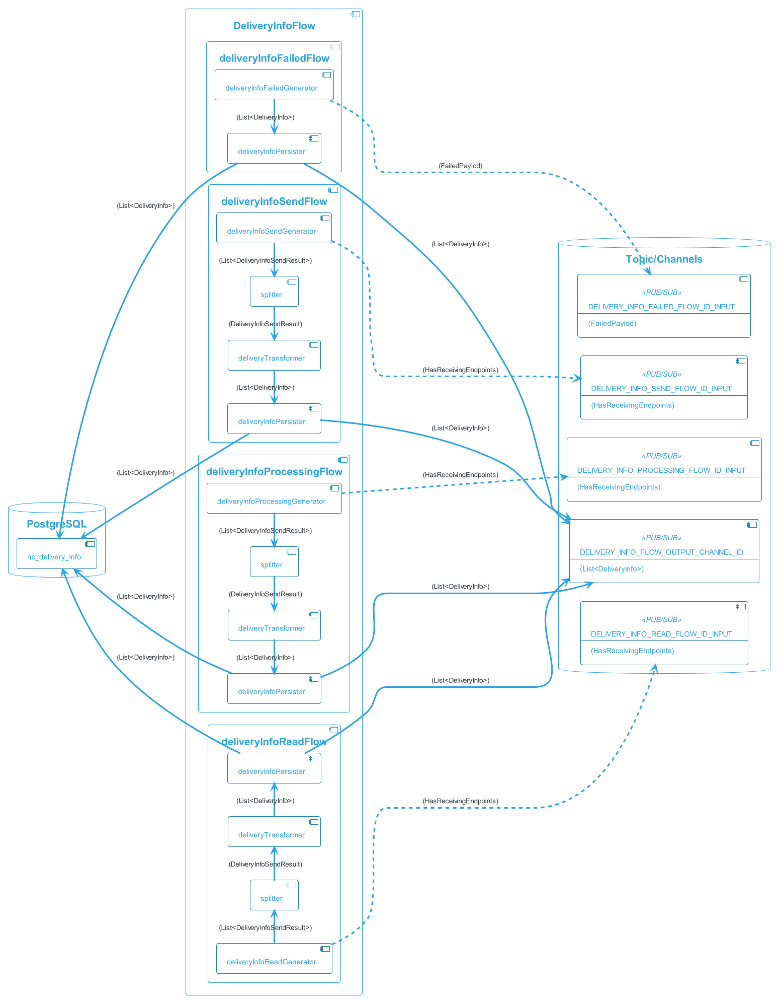

# Flows
Flow is composition of functions (build-in or provided via customization) that performs some complex logic. Flows can be further composed into final processing flow.

The data between functions in a flow (or between flows) are exchanges via spring integration channels which can me in-memory or configured to some message broker like [RabitMQ](https://www.rabbitmq.com/) or [Kafka](https://kafka.apache.org/)

## Notification processing variants 

Notiflow can operate in both PUSH and PULL mode in terms of data that can produce notification

  * **PUSH**: Notiflow exposes REST API that can be actively called to send [Input event]()/[Notification intent]()/[Message]() to notiflow and trigger notification processing
    
    Example: There is a new order in your online shop and you want to send confirmation to your customer. In that case you web shop send [Input event]() to dedicated REST API and notiflow will handle the notification aspect

  * **PULL**: Notiflow can be configured to fetch data from data source (Database, REST API,..) and decide if the data meet some criteria that could lead to notification
    
    Example: if you have a system with contracts that have expiration date, you can configure notiflow to generate notification one month before expiration.
    
    You can find full technical description of this flow in the [Notification polling chapter](#pullProcessing)

## Top-level flows
The default configuration of notiflow consists of 4 processing stages

1. [EventReceiver](): Receive and persist input application [Event]()
1. [InputEventExtensionConverting](): Event to [Intent]()/[Message]() conversion
1. [MessageProcessingFlow](): [Message]() persistance, formatting, ..
1. [Sending](): Sending different types of messages via dedicated channel

This is high level and simplified view on default notiflow message processing. 


If notiflow is configured to consume data from external data sources (PULL mode) there is an additional flow for each data source that is created dynamically based on notiflow configuration. 
There is a step where the data are converted into one either  [Input event]()/[Notification intent]()/[Message]() after which the notification follows standard processing. 


### Notification processing (PUSH)

The input to standard-flow (and thus start of input processing) can be done by calling one of tree dedicated API endpoints

  * [Input event]() 
    * call to [persistGenericEvent]() API method
    * or call REST API [Post to /events]() endpoint
  * [Notification intent]() 
    * call [processIntent]() API method
  * Specific [Message]() 
    * call [processMessage]() API method
    * or call REST API [Post to /messages]() endpoint

Which one of these three types is selected by the client depends on the particular use-case. 

  * [Input event](): This is used when you want to use notiflow as receiver of any specify application event your application can produce. This can be events like 
    * "New order" in web shop
    * "Low inventory" in warehouse 
    * User request for 2-factor authentication
    * ... and any other you might need  

   The intension using this approach is to offload as much of the notification processing from the client application as possible. The application focuses on its core business and emits event about what happen. The payload stored in [Input event] can be completely custom and unknown to notiflow

  * [Notification intent](): TODO
  * [Message](): Client application already knows everything about the notification it wants to send, especially 
    * who is the recipient
    * what is the message type ([Email]()/[SMS]()/[Push]()/...)
    * what is the message content
   
    but still wants to use features like [message delivery guaranties](), [journaling](), [spam preventions](), [statistics]() and others   

## Input event routing flow <span id="inputEventRoutingFlow"/>


[Input event routing flow](#inputEventRouting) is responsible for

* Receive an [event](entities.md#inputEvent) and return control to the caller as soon as possible
    * Receive an [event](entities.md#inputEvent)
    * persist the event 
    * return controls to the caller as soon as event persisted in notiflow DB
* [Poll for events]() which should start processing and route them based on the notiflow [configuration]() for input event routing for further processing

This step is only active if client what to use [event]() as a starting point for notification processing

## Input event extension converting flow <span id="inputEventExtensionConvertingFlow"/>


This [flow]() is a place of common customization. It main purpose is 

  * translate [event]() to either
    * [message]()

      or

    * [notificationIntent]()

Because the payload in event is not know to notiflow, client has to provide custom implementation of such conversion. This is done by implementing [InputEvent2MessageConverterExtension]() interface. For example

```java
        @Bean
        public InputEvent2MessageConverterExtension event2Message() {
            return new InputEvent2MessageConverterExtension () {

				@Override
				public Optional<PayloadValidationException> canHandle(GenericEvent payload) {
					if (payload.getPayloadAsPojo() instanceof TestPayload) {
						return Optional.empty();
					}
					
					return Optional.of(new PayloadValidationException("No test payload"));					
				}

				@Override
				public List<com.obj.nc.domain.message.Message<?>> convertEvent(GenericEvent event) {					
					EmailMessage email1 = new EmailMessage();
					email1.addReceivingEndpoints(
						EmailEndpoint.builder().email("test@objectify.sk").build()
					);
					email1.getBody().setSubject("Subject");
					email1.getBody().setText("text");

					List<com.obj.nc.domain.message.Message<?>> msg = Arrays.asList(email1);

					return msg;
				}            	
            };
        }
```

> InputEvent2MessageConverterExtension implementation has to be registered as Spring @Bean

## Intent processing flow <span id="intentProcessingFlow"/>
TODO

## Message processing flow <span id="messageProcessingFlow"/>

The responsibility of this flow is to 

 * perform journaling for all [messages]() which are about to be send. This includes persistance of [message]() and information about [recipient]() of the message. 
 * route the [message]() to type dependent sender 

 This flow has API that allows to interact with it. Example:

```java
 @Autowired private MessageProcessingFlow msgFlow;

 void exampleSendMessage()  {
        EmailMessage msg = ...

        // when
        msgFlow.processMessage(msg);
 }
```

## Email processing flow <span id="emailProcessingFlow"/>

The responsibility of this flow is to 

 * if the [email is templated](), formate it to final [email message]()
   * if [email is localized](), send email-per-locale or aggregated into one email
 * decorated html [emails]() to track mail opened by recipient
 * send [email]()

This flow has API that allows to interact with it. Example:

```java
 @Autowired private EmailProcessingFlow emailSendingFlow;

 void exampleSendFormattedEmail()  {
        EmailMessageTemplated<?> email = ...
        emailSendingFlow.formatAndSend(email);
        ...
 }
```
or 
```java
@Autowired private EmailProcessingFlow emailSendingFlow;

void exampleSendEmail() {
    EmailMessage email = ...
        
    EmailMessage emailSent = emailSendingFlow
            .sendEmail(email)
        	.get(1, TimeUnit.SECONDS);
}
```

## SMS processing flow <span id="smsProcessingFlow"/>

The responsibility of this flow is to

 * format [SMS message]() content (only templated SMS are supported as of now)
 * send [SMS message]()

## MailChimp processing flow <span id="mailchimpProcessingFlow"/>

The responsibility of this flow is to
 
 * send Email message using [MailChimp transactional API](https://mailchimp.com/developer/transactional/). Formatting of the email is in responsibility of MailChimp

## Push message processing flow <span id="pushProcessingFlow"/>

The responsibility of this flow is to

* send Push notification using [Firebase Cloud Messaging](https://firebase.google.com/docs/cloud-messaging/) to target topic or device

## Error handling flow


In the case of exception in any [function]() participating in a [flow](), the message that caused the error is received by this channel with the information about which step was the last that failed. This flow is responsible for

  * resurrection af the failed message and execution of retry 

For this to work in any situation, [transaction boundaries]() for steps in flows have to be carefully defined

## External data-source notification data polling (PULL) <span id="pullProcessing"/>

You are able to configure data sources that provide notiflow with arbitrary data. You can then configure conditions to check against the data and if matched notiflow will trigger notification processing based on further configuration. 
This mode is useful if you have application with for example contracts or orders and you want to be notified one month before contract expires.  

Check configuration root `com.obj.nc.flows.dataSources.DataSourceFlowsProperties` to see options available
for each of the pull strategies.

### http
Connects to a HTTP endpoint (GET request). Data can be further filtered using spel-filter-expression.

Example configuration:
```
   nc.data-sources.http[0].name=TEST0-DS
   nc.data-sources.http[0].url=http://service-0/json
   nc.data-sources.http[0].pojoFCCN=com.obj.nc.flows.dataSources.config.TestLicenseAgreement
   nc.data-sources.http[0].cron=*/5 * * * * *
   nc.data-sources.http[0].externalIdAttrName=id
   nc.data-sources.http[0].spel-filter-expression=isExpired(5)   
```

Also check `com.obj.nc.flows.dataSources.http.HttpDataSourceFlowsTest` for example configuration/usage.

### jdbc

Connects to a database using JDBC and performs a SQL query.

```
nc.data-sources.jdbc[0].name=test-ds
nc.data-sources.jdbc[0].url=jdbc:postgresql://localhost:25432/nc
nc.data-sources.jdbc[0].username=nc
nc.data-sources.jdbc[0].password=xxx
nc.data-sources.jdbc[0].jobs[0].name=check-agreements-expiry
nc.data-sources.jdbc[0].jobs[0].entity-name=license_agreement
nc.data-sources.jdbc[0].jobs[0].sqlQuery=select * from license_agreement  
nc.data-sources.jdbc[0].jobs[0].pojoFCCN=com.obj.nc.flows.dataSources.config.TestLicenseAgreement     
nc.data-sources.jdbc[0].jobs[0].cron=*/5 * * * * *
nc.data-sources.jdbc[0].jobs[0].spel-filter-expression=isExpired(5)        
```

Also check `com.obj.nc.flows.dataSources.PullNotifDataToNotificationTest` for example configuration/usage.

### firestore

Connects to a firestore database and performs a document collection query.

```
nc.data-sources.firestore[0].name=test-ds
nc.data-sources.firestore[0].serviceKeyPath=/test/path/file.json
nc.data-sources.firestore[0].appName=test-app
nc.data-sources.firestore[0].databaseUrl=https://test-database-url.com
nc.data-sources.firestore[0].jobs[0].name=test-cvs
nc.data-sources.firestore[0].jobs[0].collectionName=cv_view
nc.data-sources.firestore[0].jobs[0].pojoFCCN=com.obj.nc.flows.dataSources.config.TestCv
nc.data-sources.firestore[0].jobs[0].cron=*/2 * * * * *
nc.data-sources.firestore[0].jobs[0].selectedProperties=certificate,createdAt
```

Also check `com.obj.nc.flows.dataSources.firestore.FirestoreDataSourceFlowsTest` for example configuration/usage.

User can plug in custom queries by registering a `com.obj.nc.flows.dataSources.firestore.extensions.FirestoreQueryExtension` implementation.

Example:

```
#nc.data-sources.firestore[0].jobs[0].queryExtensionBeanName=firestoreQueryExtensionExtern
```

```
@Component(value = "firestoreQueryExtensionExtern")
public class FirestoreQueryExtensionExtern implements FirestoreQueryExtension {

    @Override
    public Query createCustomQuery(CollectionReference collectionReference) {
        Instant yesterdayInstant = LocalDate.now().minusDays(1).atStartOfDay().atZone(ZoneId.systemDefault()).toInstant();
        Timestamp yesterdayFirestoreTimestamp = Timestamp.of(Date.from(yesterdayInstant));
        return collectionReference.whereGreaterThanOrEqualTo("updatedAt", yesterdayFirestoreTimestamp);
    }
}
```

## Delivery Info flows <span id="deliveryInfoFlow"/>

These flows are responsible for persistance of various journaling information. They listen on predefined topics and document delivery information for given [event](), [intent]() and [message]()

The information is later used in [notiflow UI]() for statistics and analytics

## Test mode flow <span id="testMode"/>
This is an internal flow which is used in [test mode](). Its responsibility is to 

 * Wait for certain time for messages which should have been send if [test mode]() was not active
 * Aggregate them into single digest Email message
 * Send aggregated email to predefined recipient
