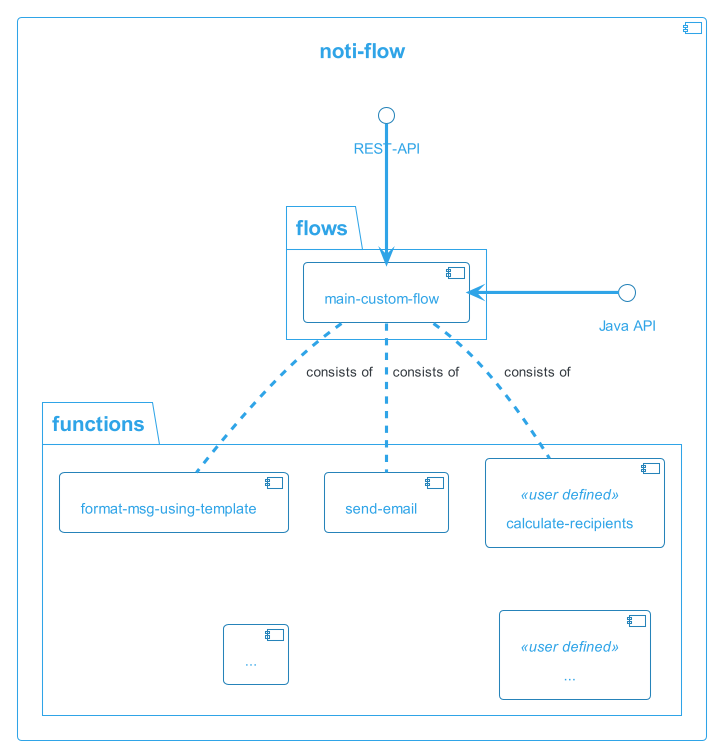

# Notiflow
Notiflow is software framework for reliable delivery of email, push notifications and other types of messages. It is written in Java and it uses various Spring modules especially Spring integration. 

* You can find the full list of [features](features.md)
* To create your first "Hello world" project, check the [Getting started](getting-started.md) section
* To learn more about the architecture and how it is build, check the [architecture and design](#architecture) section

## Goals
The main goal of notiflow is to greatly simplify delivery of information messages to the end user of your application. This is achieved by providing solution for many generic problems of message delivery while taking into account the was diversity of use-cases in which application operate and send messages. The problems which notiflow is solving are

  * allow application to emit events and don't worry about who and what should be communicated to the end-users on those events
  * hide complexity of sending messages via different channels like Email, Push, Sms, Mailchimp, ..
  * allow for scalability from tiny to thousand messages per second
  * ensure reliable delivery with delivery error handling 
  * provide comprehensive monitoring and debugging of messages processing
  * provide UI for message delivery statistics, metrics and processing details
  * allow for testing message routing, formatting and delivery
  * end-user spam prevention
  * message aggregation

To understand in details how notiflow is solving this problems check the full list of features [here](features.md)

## Architecture and design 
Main design characteristics of Notiflow are focusing about achieving two main principles

  * Allow for high level of customization
  * Provide solution which can be used as 
    * embedded library 
    * standalone application on single machine
    * microservice oriented application operating on computer cluster of any size to achieve high level of thruput

To achieve this goals notiflow is implemented as

  * set of independent [functions](functions) where each function is performing exactly one thing (event conversion, email sending, formatting, aggregation, .. )
  * notiflow provide default composition of these [functions](functions.md) which are called [flows](flows). 

Both [functions](functions) and [flows](flows) can be added custom functionality is required. It is also possible to customize existing [functions](functions) or [flows](flows) using configuration properties or by providing completely custom implementation. You can use Notiflow as

  * embedded into your existing application
    
  * create custom microservice for notification processing
    

## Functions 

A [function](functions.md) in notiflow is a component which performs single distinct operation. It can be a transformation, getting data from another system, persisting processing information or anything else which is important for message delivery.

To see full list of implemented [functions](functions.md) and for detail description of each individual function, check the [API documentation on functions]()

## Flows 
[Flow](flows.md) is composition of [functions](functions.md) (build-in or provided via customization) that performs some complex logic. [Flows](flows.md) can be further composed into final processing [flow](flows.md).

The data exchange between [function](functions.md) in a flow (or between flows) is performed using exchange of data objects which is implemented based on the scalability and deployment requirements either 

  * in-memory 
  * [RabbitMQ](https://www.rabbitmq.com/)
  * [Kafka](https://kafka.apache.org/)

To understand what is the composition of [functions](functions.md) into each individual [flow](flows.md), navigate to the [Flows](flows.md) chapter

The description of data structures and entities exchanged between [functions](functions.md) and [flows](flows.md) can be found in [Entities](entities.md) chapter

## Web UI 
Notiflow ships with monitoring and reporting UI written in ReactJS. It aim is to provide

* reporting and monitoring dashboards
* graphical interface for configuration of various aspects of notiflow
* support for message routing and delivery testing [Test mode]()

For complete documentation and screenshots of UI navigate to [Web UI]() chapter

## Let's start 
To start using Notiflow in your project, navigate to the [Getting started](getting-started.md) section
